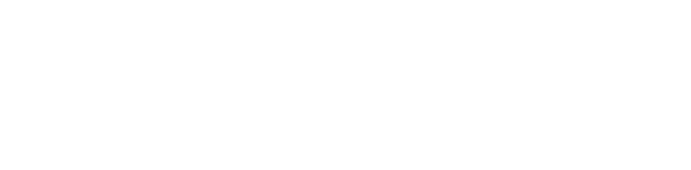
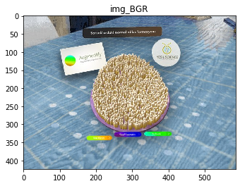
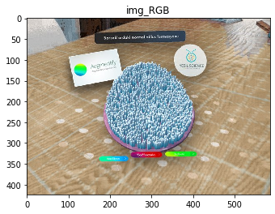
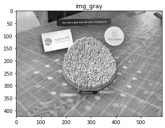
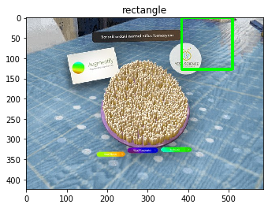
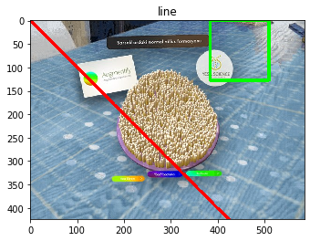
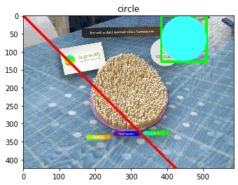
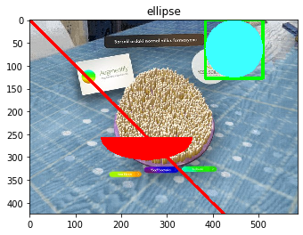

Introduction to OpenCV

 

# Week 1
## Introduction to OpenCV
*  Read an image using OpenCV
*  Capture videos from camera
*  Drawing Functions
*  Mouse Events
*  Creating a trackbar

### Before we get started:
##### If we want to use OpenCV, the easiest way to get started is  to use Anaconda. After downloading Anaconda from the site, open "Anaconda Terminal" (I recommend 64 Bit Python 3.7):

##### conda create — name opencv 
##### activate opencv
##### conda install -c conda-forge opencv


# Let's start!


```python
import numpy as np
from matplotlib import pyplot as plt
import cv2
%matplotlib inline

cv2.__version__
```


    '3.4.5'


# 1.) Get started with Images

Functions we are going to learn: cv2.imread(), cv2.imshow(), cv2.imwrite()

## Read an image using OpenCV


```python
img_BGR = cv2.imread('augmentify.jpg')
img_RGB = cv2.cvtColor(img_BGR, cv2.COLOR_BGR2RGB)
img_gray = cv2.cvtColor(img_BGR, cv2.COLOR_RGB2GRAY)

print(img_gray)


```

    [[205 204 206 ... 165 160 163]
     [206 209 206 ... 161 159 160]
     [208 220 203 ... 181 183 182]
     ...
     [138 132 141 ... 124 118 121]
     [142 146 148 ... 132 128 130]
     [151 140 140 ... 126 123 123]]
    


```python
plt.imshow(img_BGR)
plt.title('img_BGR')
plt.show()

plt.imshow(img_RGB)
plt.title('img_RGB')
plt.show()

plt.imshow(img_gray, cmap='gray')
plt.title('img_gray')
plt.show()

height, width, depth = img_BGR.shape
print('Image Width: {}px, Image Height: {}px, Image Depth: {}ch'.format(width, height, depth))

#cv2.imshow('image', img_normal)
#cv2.waitKey(0)
#cv2.destroyAllWindows()
```











    Image Width: 586px, Image Height: 424px, Image Depth: 3ch
    

## Image saving


```python
cv2.imwrite('gray_augmentify.png', img_gray)
```


    True


# 2.) How to use USB Webcam?
### check the camera_frame.py  

# 3.) Drawing Functions

### Rectangle
#### You need top-left corner and bottom-right corner of rectangle.


```python
import numpy as np
import cv2

rectangle = cv2.rectangle(img_BGR,(384,0),(510,128),(0,255,0),5)
plt.imshow(rectangle)
plt.title('rectangle')
plt.show()
```





### Line 
#### starting and ending points of line


```python
line = cv2.line(img_BGR,(0,0),(511,511),(255,0,0),5)
plt.imshow(line)
plt.title('line')
plt.show()
```





### Circle 
#### You need its center coordinates and radius.


```python
circle = cv2.circle(img_BGR,(447,63), 63, (60,255,255), -1)
plt.imshow(circle)
plt.title('circle')
plt.show()
```





### Ellipse
#### One argument is the center location (x,y). Next argument is axes lengths (major axis length, minor axis length). 
#### angle is the angle of rotation of ellipse in anti-clockwise direction. startAngle and endAngle denotes the starting and 
#### ending of ellipse arc measured in clockwise direction from major axis. i.e. giving values 0 and 360 gives the full ellipse.


```python
ellipse = cv2.ellipse(img_BGR,(256,256),(100,50),0,0,180,255,-1)
plt.imshow(ellipse)
plt.title('ellipse')
plt.show()
```





### Polygon 
#### You need coordinates of vertices
#### These are array of shape ROWSx1x2 where ROWS are number of vertices and it should be of type int32


```python
pts = np.array([[100,100],[50,30],[70,80],[50,400]], np.int32)
pts = pts.reshape((-1,1,2))
polygon = cv2.polylines(img_BGR,[pts],True,(0,0,255))
plt.imshow(polygon)
plt.title('polygon')
plt.show()
```


# 4.) Mouse Events
### Check the mouse_opencv.py file

# 5.) Creating a trackbar
### check the trackbar_opencv.py file.

________________________________________________________________________________________

##### Week 1, Introduction to OpenCV
###### Mustafa Mert Tunalı, Yesil Science, Team AI
 
